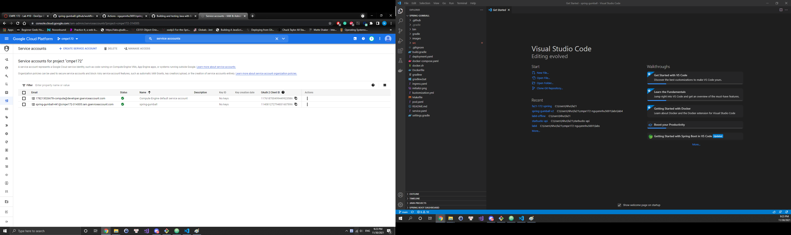
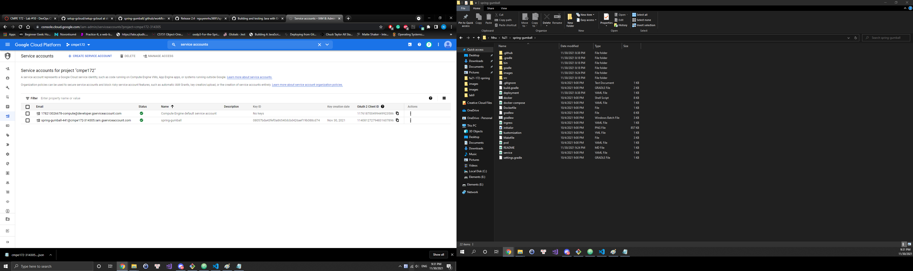
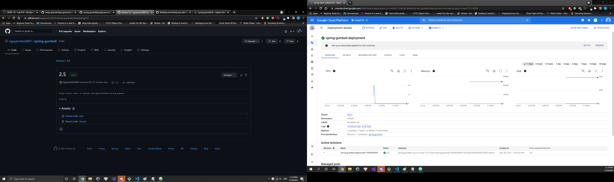
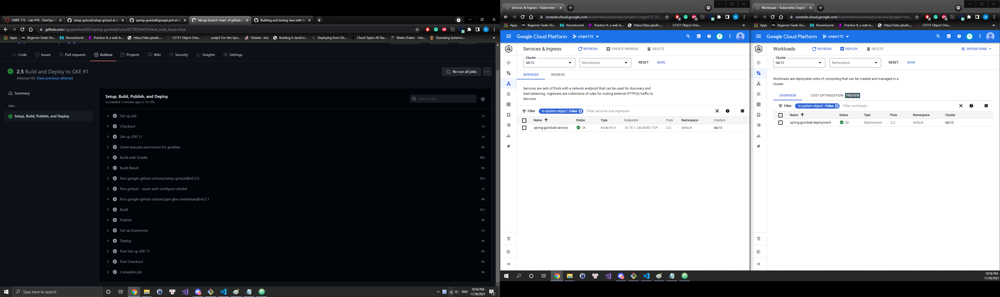
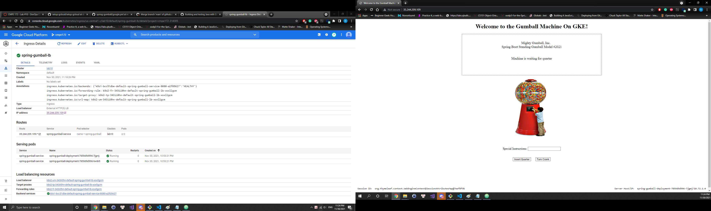
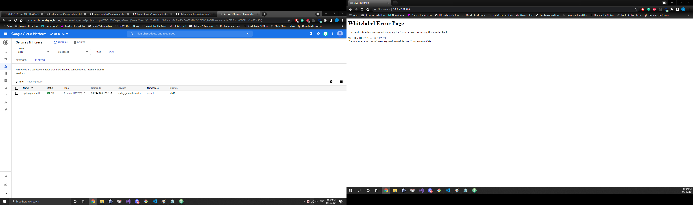

# spring-gumball ci/cd example
## CI Workflow
* Using the default yml is not suffient enough and gave errors so I had to change the gradle-publish.yml to the content provided
* CI Workflow deployed on Github

## CD Workflow
* Service account with admin and storage rights created

* Service account key created as JSON, download and set secrets in Github repo's setting

* Create new workflow for GKE, the workflow runs will be triggered by releases

* Manually create Ingress in GKE

* The application powered up but when I try using it by inserting a coin it shows a WhiteLabel error

