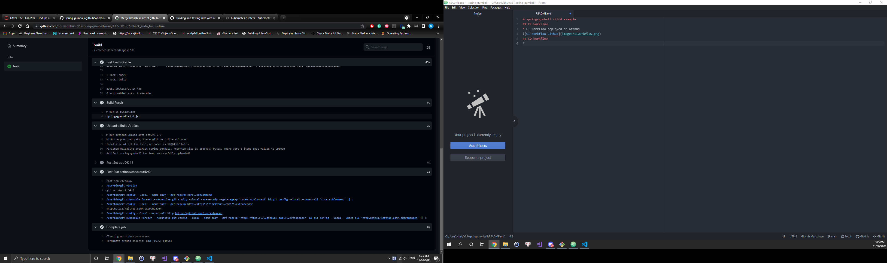

# spring-gumball ci/cd example
## CI Workflow
* Using the default yml is not suffient enough and gave errors so I had to change the gradle-publish.yml to the content provided 
* CI Workflow deployed on Github

## CD Workflow
*
